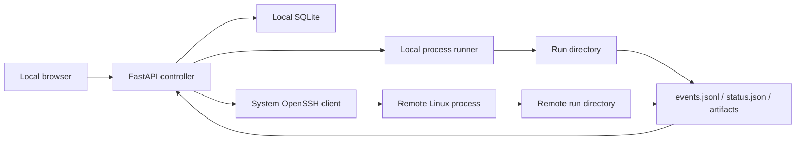

# Architecture

ResearchLab is a local single-user application. The browser and controller run
on the researcher's Windows or Linux workstation. A remote Linux training
server needs only OpenSSH, Python, and the selected accelerator stack.



## Hard boundaries

ResearchLab standardizes only:

1. `project.yaml`: task entrypoints and user-facing parameter schemas.
2. Immutable source versions: timestamped snapshots, optionally uploaded by SSH.
3. Launch context: environment, selected devices, run ID, and output directory.
4. Events and artifacts: portable JSONL plus ordinary files.

Model architecture, datasets, augmentation, memory placement, losses,
optimizers, and training loops remain ordinary user-owned Python.

## Storage

Local application state defaults to `~/.researchlab`:

```text
~/.researchlab/
  researchlab.db
  projects/<project>/versions/<timestamp_name>/
    source/
    runs/<timestamp_name>/
      train.log
      status.json
      events.jsonl
      artifacts/
```

The corresponding remote layout is:

```text
<remote_root>/projects/<project>/versions/<timestamp_name>/
  source/
  runs/<timestamp_name>/
```

Datasets stay outside these trees and are passed to projects as server paths.

## Execution

- Local Windows/Linux: a detached process group runs the selected Python command.
- Remote Linux: the controller uploads a source archive, then launches a
  detached process through SSH. No daemon or inbound port is installed remotely.
- Multiple devices: `launcher: auto` selects `torchrun` when more than one
  device is chosen.
- CUDA selection uses `CUDA_VISIBLE_DEVICES`.
- Ascend selection uses `ASCEND_RT_VISIBLE_DEVICES`; the project initializes
  HCCL when it uses distributed NPU training.

## Environment handling

Environment discovery reads `conda env list --json`, probes each Python
interpreter, and records Python, PyTorch, CUDA, and `torch_npu` capabilities.
The result is checked against the version constraints in `project.yaml`.

Creating an environment always uses a new Conda prefix below
`<remote_root>/.envs`. Existing environments are read-only.

## Security

- The controller binds to loopback and accepts JSON API requests only.
- SSH aliases reuse `~/.ssh/config` and SSH Agent; private keys and passwords
  are never stored in ResearchLab.
- Source archive extraction rejects traversal paths and symbolic links.
- Project entrypoints cannot escape their source directory.
- Artifact reads cannot escape their run directory.
- Source versions are never overwritten.

## Extension point

Analysis commands should consume run metadata/events/artifacts and emit the
same event protocol. This supports future comparison and analysis without a
speculative plugin hierarchy.

